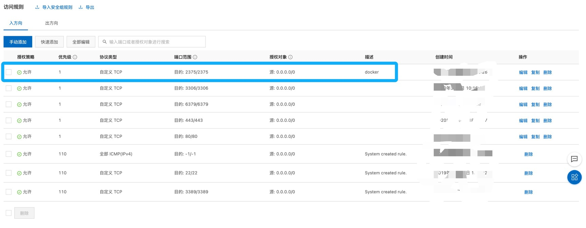
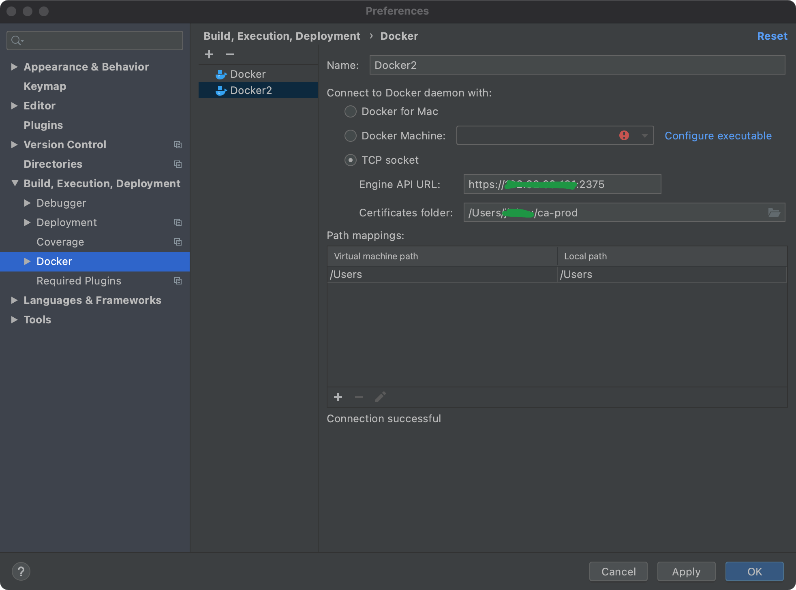

> 以下操作基于CentOS/7+环境

## 生成CA证书

创建目录

```sh
mkdir -p /etc/docker && cd /etc/docker
```

生成RSA私钥

```sh
openssl genrsa -aes256 -out ca-key.pem 4096
```

### 生成CA证书

```sh
openssl req -new -x509 -days 999 -key ca-key.pem -sha256 -subj "/CN=*" -out ca.pem
```

### 创建服务端私钥

```sh
openssl genrsa -out server-key.pem 4096
```

创建服务端请求签名证书

```sh
openssl req -subj "/CN=*" -sha256 -new -key server-key.pem -out server.csr
```

添加IP白名单

```sh
echo subjectAltName = DNS:127.0.0.1,IP:127.0.0.1,IP:0.0.0.0,IP:外网IP >> extfile.cnf
```

> 此处还需要配置外网IP

密钥仅用于服务器身份验证

```sh
echo extendedKeyUsage = serverAuth >> extfile.cnf
```

### 创建签名生效的服务端证书

```sh
openssl x509 -req -days 999 -sha256 -in server.csr -CA ca.pem -CAkey ca-key.pem -CAcreateserial -out server-cert.pem -extfile extfile.cnf
```

### 创建客户端私钥

```sh
openssl genrsa -out key.pem 4096
```

创建客户端签名请求证书

```sh
openssl req -subj "/CN=client" -new -key key.pem -out client.csr
```

创建extfile.cnf的配置文件

```sh
echo extendedKeyUsage = clientAuth > extfile-client.cnf
```

### 创建签名生效的客户端证书

```sh
openssl x509 -req -days 999 -sha256 -in client.csr -CA ca.pem -CAkey ca-key.pem -CAcreateserial -out cert.pem -extfile extfile-client.cnf
```

删除多余的文件

```sh
rm -rf ca.srl client.csr extfile.cnf extfile-client.cnf server.csr
```

## 配置TSL连接

```sh
vim /lib/systemd/system/docker.service
```

找到ExecStart = 开头的一行代码，把默认的

```sh
ExecStart=/usr/bin/dockerd -H fd:// --containerd=/run/containerd/containerd.sock
```

其替换为如下内容(其实是直接在后面追加 --tlsverify...)

```sh
ExecStart=/usr/bin/dockerd -H fd:// --containerd=/run/containerd/containerd.sock \
	--tlsverify --tlscacert=/etc/docker/ca.pem \
	--tlscert=/etc/docker/server-cert.pem \
	--tlskey=/etc/docker/server-key.pem \
	-H tcp://0.0.0.0:2375
```

重启Docker

```sh
systemctl daemon-reload && systemctl restart docker
```

## 服务器配置

将/etc/docker下的ca.pem、cert.pem、key.pem复制到客户端指定文件夹下

```sh
[root@webserver docker]# ll
总用量 32
-rw-r--r-- 1 root root 3326 1月  16 01:25 ca-key.pem
-rw-r--r-- 1 root root 1765 1月  16 01:25 ca.pem
-rw-r--r-- 1 root root 1696 1月  16 01:26 cert.pem
-rw-r--r-- 1 root root  195 1月  16 00:11 daemon.json
-rw------- 1 root root  244 1月  16 00:11 key.json
-rw-r--r-- 1 root root 3247 1月  16 01:26 key.pem
-rw-r--r-- 1 root root 1744 1月  16 01:26 server-cert.pem
-rw-r--r-- 1 root root 3243 1月  16 01:25 server-key.pem
```

开放服务器端口

```sh
firewall-cmd --zone=public --add-port=2375/tcp --permanent
```

服务器添加入规则



## IDE配置



## 总结


::: danger
<ul>
如果是云服务器，需要做以下配置：
<li>添加IP白名单时，需要添加外网IP</li>
<li>防火墙开放，2375端口</li>
<li>配置入规则，2375端口</li>
</ul>

:::

