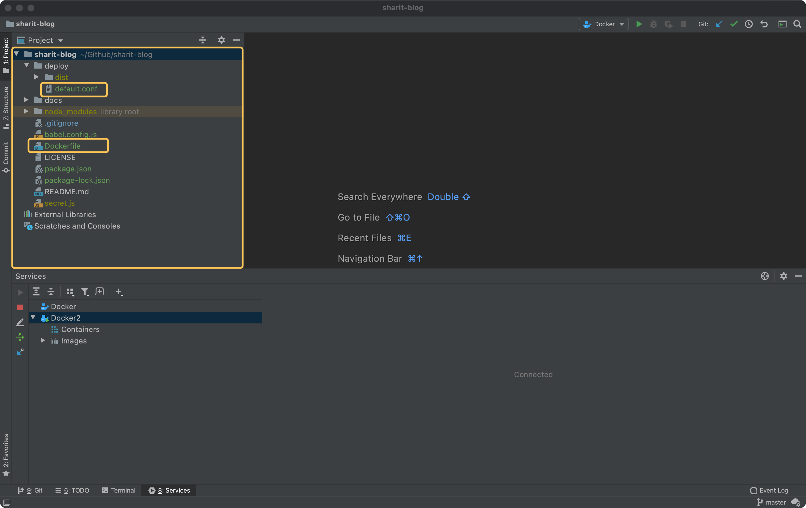
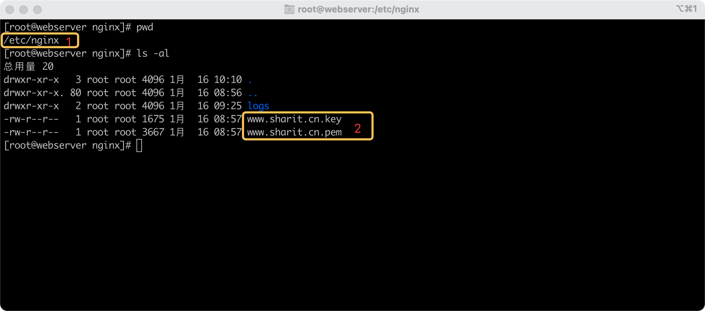
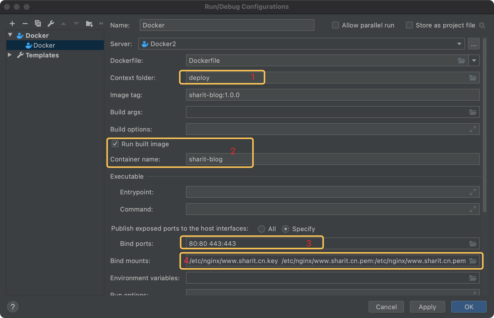
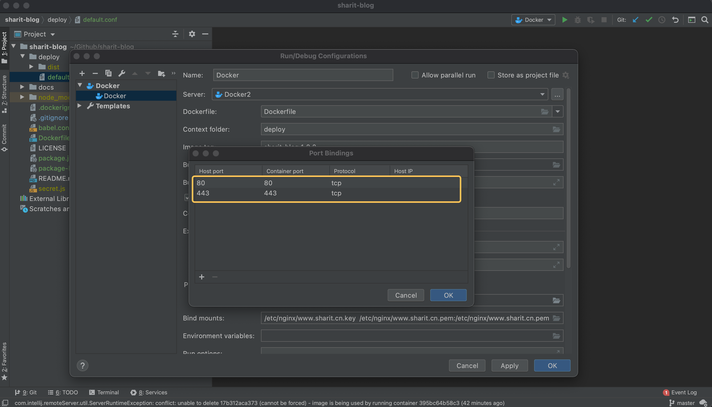
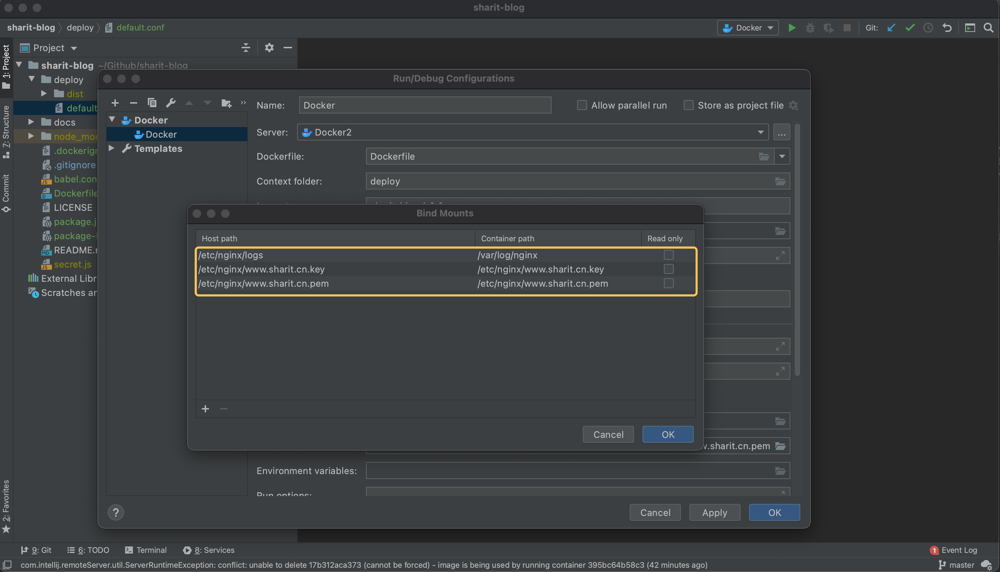
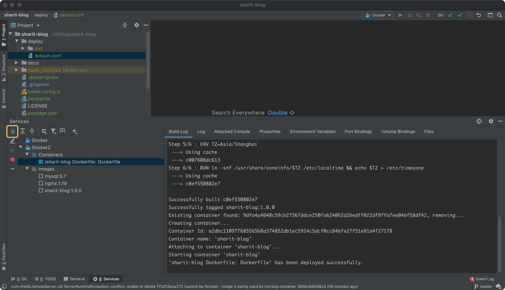

## 配置项目构建路径

### Dockerfile

在项目根目录下，创建Dockerfile文件

```dockerfile
#指定基础镜像，在其上进行定制
FROM nginx:1.19

VOLUME /tmp

#复制上下文目录下的 dist/ 到容器里
COPY dist/ /usr/share/nginx/html/

COPY default.conf /etc/nginx/conf.d/default.conf

#设置docker容器环境时区
ENV TZ=Asia/Shanghai
RUN ln -snf /usr/share/zoneinfo/$TZ /etc/localtime && echo $TZ > /etc/timezone
```

### default.conf

在根目录下创建deploy文件夹，然后创建default.conf文件，内容：

```ruby
server {
    listen       443 ssl;
    server_name sharit.cn www.sharit.cn;
    root         /usr/share/nginx/html;
    ssl_certificate www.sharit.cn.pem;
    ssl_certificate_key www.sharit.cn.key;
    ssl_session_timeout  5m;
    ssl_session_cache    shared:SSL:1m;
    ssl_ciphers          ECDHE-RSA-AES128-GCM-SHA256:ECDHE:ECDH:AES:HIGH:!NULL:aNULL:!MD5:!ADH:!RC4;
    ssl_protocols        TLSv1 TLSv1.1 TLSv1.2;
    ssl_prefer_server_ciphers  on;

    location / {
        root   /usr/share/nginx/html;
        index  index.html index.htm;
        proxy_redirect off;
        proxy_set_header Host $host:$server_port;
        proxy_set_header X-Real-IP $remote_addr;
        proxy_set_header X-Forwarded-For $proxy_add_x_forwarded_for;
    }

    location @router {
        rewrite ^.*$ /index.html last;
    }

}

server {
    listen 80;
    server_name sharit.cn www.sharit.cn;
    rewrite ^ https://$host$1 permanent;
}
```

项目目录结构



在宿主服务器上创建目录

```sh
mkdir -p /etc/nginx
mkdir -p /etc/nginx/logs
```

将生成的SSL证书文件复制到服务器对应的目录



### Docker构建上下文路径

:::danger

Docker默认会把项目根目录作为上下文环境路径，由于项目根目录有node_modules文件夹，docker构建镜像时会出现"文件路径太长的错误"，所以我们需要修改docker构建镜像时的上下文路径。

:::



> 1.构建镜像时的上下文环境路径
>
> 2.构建完成后运行容器镜像
>
> 3.宿主机:容器端口映射
>
> 4.宿主机:容器目录挂载

端口映射



目录挂载



### 项目编译输出目录

vuepress项目，docs/.vuepress/config.js

```js
dest: 'deploy/dist', // .vuepress/dist
```

标准的vue项目，vue.config.js

```js
outputDir: 'deploy/dist',
```

## 编译项目

```
vuepress build docs
#npm run build
```

## 部署项目

部署



部署成功日志

```bash
Sending build context to Docker daemon...
[==================================================>] 520.0kB
Done

Step 1/6 : FROM nginx:1.19
 ---> f6d0b4767a6c
Step 2/6 : VOLUME /tmp
 ---> Using cache
 ---> b59d67a878c9
Step 3/6 : COPY dist/ /usr/share/nginx/html/
 ---> Using cache
 ---> 2f969fa176ac
Step 4/6 : COPY default.conf /etc/nginx/conf.d/default.conf
 ---> Using cache
 ---> 6ad563646c28
Step 5/6 : ENV TZ=Asia/Shanghai
 ---> Using cache
 ---> c007608dc613
Step 6/6 : RUN ln -snf /usr/share/zoneinfo/$TZ /etc/localtime && echo $TZ > /etc/timezone
 ---> Using cache
 ---> c0ef550802e7

Successfully built c0ef550802e7
Successfully tagged sharit-blog:1.0.0
Existing container found: 9dfa4a4648c59cb27367ddce250fa624062d26edff022df97fa7ee04bf58df42, removing...
Creating container...
Container Id: a2dbc110977685565b8a374852db1ec5924c5dcf0cc84bfe27f51e81a4f27178
Container name: 'sharit-blog'
Attaching to container 'sharit-blog'...
Starting container 'sharit-blog'
'sharit-blog Dockerfile: Dockerfile' has been deployed successfully.
```

